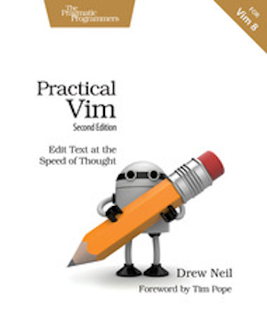
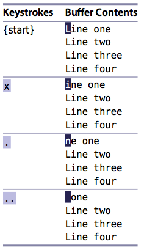
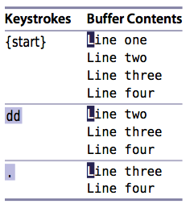
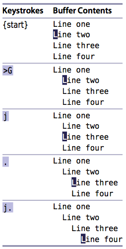

---

### Practical Vim

Edit Text at the Speed of Thought 
by Drew Neil

---

### 1. Vim Way

#### Tips

  - Tip 1. Meet the Dot Command
  - Tip 2. Don't Repeat Yourself
  - Tip 3. Take One Step Back, Then Three Forward
  - Tip 4. Act, Repeat, Reverse
  - Tip 5. Find and Replace by Hand
  - Tip 6. Meet the Dot formula

---

### 1. Vim Way

#### Tip 1. Meet the Dot Command

The dot command lets us repeat the last change. It is the most powerful and versatile command in Vim.

+++

The `x` command deletes the character under the cursor. When we use the dot command in this context, “repeat last change” tells Vim to delete the character under the cursor.

+++

The `dd` command also performs a deletion, but this one acts on the current line as a whole. If we use the dot command after dd, then “repeat last change” instructs Vim to delete the current line.

+++

Finally, the `>G` command increases the indentation from the current line until the end of the file. If we follow this command with the dot command, then “repeat last change” tells Vim to increase the indentation level from the current position to the end of the file.

---

#### Some Related Links

- [Homepage]()
